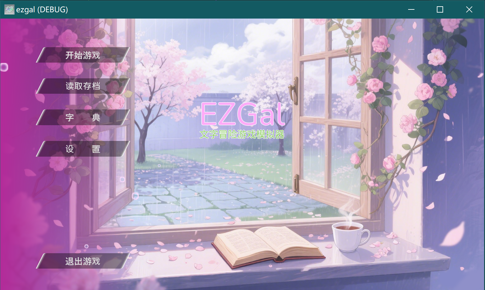

<div align="center" style="display:grid;place-items:center;">
<p>
    <a href="https://gitee.com/cryingn/ezgal" target="_blank"></a>
<h1>ezgal</h1>
</p>
</div>

这是一个基于godot.mono便于开发galgame的一套框架.



## 描述

我们在2023年11月初步实现了godot3的ezgal框架, 但是因为扩展性问题放弃继续维护, 后续对引擎进行了重写, 以下是当前新ezgal框架的特性:

| 描述       | ezgal                                                                              | 说明人     |
| -------- | ---------------------------------------------------------------------------------- | ------- |
| godot版本  | godot4(考虑持续兼容)                                                                     | cryingn |
| 开发语言     | Csharp                                                                             | cryingn |
| 开发模式     | 支持2种开发模式: [深度嵌入](#深度嵌入)便于打包为一个文件, 并开发更多功能, [低代码开发](#低代码开发)也可以通过接口直接将编译文件作为开发程序进行编写 | cryingn |
| ezgal解释器 | 将剧本文件解释为json格式并逐段进行读取                                                              | cryingn |
| 剧本语法     | 为便于剧本写作与演出分离, ez_gal本身支持的语法高度划分了台词与剧本演出                                            | cryingn |

## 使用

### 深度嵌入

你可以直接将源码克隆到你的项目中, 并将**ezgal**文件夹导入到godot中接着开发:

```bash
git clone https://gitee.com/cryingn/ezgal
cd ezgal/ezgal
```

在编写完成后想要打包为一个程序可以直接通过**make**文件夹打包进`./ezgal/code/FlowData.cs`文件夹进行编译:

```bash
dotnet run --project make
```

godot编译的程序可以不依赖文件夹运行, 如果需要恢复到文件的编辑状态, 可以使用以下指令进行恢复:

```bash
dotnet run --project make test
```

### 低代码开发

(这是未来ezgal的主流开发方式, 只需要在程序外修改文件夹的内容就可以实现开发)

在获取二进制文件后也可以通过直接编辑文件外的文件夹内容实现脚本/立绘/字典/音乐等资源的修改.

## 语法

为使得剧本写作更加直观, 台词与演出采用了分开书写的形式.以下分别针对台词和演出进行说明:

### 台词

台词可以采用`对话框`展示:

```
[对话框]
这是采用对话框的显示方式
少女:这是对话框下少女的说话方式
```

还有`全屏`展示:

```
[全屏]
全屏支持显示多段内容
但不支持由角色说话
全屏状态下支持同时说12行
[全屏]
我们也可以再次定义以提前切换行数
```

`选项`的展示方式与`对话框`和`全屏`相同, 但是会将选项的内容进行存储, 并允许玩家进行选择:

```
[选项]
{script:测试3.txt}跳转测试3
{jump:循环1}跳转循环1
继续
[全屏]
选择全屏以后可以看到这段话
```

台词支持bbcode语法, 我们可以通过使用以下方法定义一些专业名词:

```
[全屏]
这是一个[url=专业名词]专业名词[/url]
```

通过选择专业名词会出现字典框, 我们可以在dictionary文件夹定义`专业名词.txt`文件, 实现设置专业名词的功能.

### 演出

出现需要回溯的剧本位置时可以通过`@`设置跳转的**标记位置**, 比如以下方式:

```
@循环1
这里是一个死循环
{jump:循环1}
```

在进行跳转时会回到`@循环1`的位置, 除了设置**标记位置**之外的演出方式统一用大括号进行管理, 比如以下方式:

```
{bg:封面.png}#切换封面
{少女:normal.png-1200x650-1.1}少女:大家好#设置立绘
{script:测试2.txt, jump:循环1}#跳转到测试2脚本的循环1位置
```

以下定义了大括号的参数如下:

| 参数        | 说明                                                                                 | 例子                         |
| --------- | ---------------------------------------------------------------------------------- | -------------------------- |
| bg        | 设置背景, 背景应该在`./image/background/`文件夹中                                               | bg:封面.png                  |
| script    | 跳转到设定的脚本位置                                                                         | script:测试3.txt             |
| jump      | 跳转到设定的**标记位置**                                                                     | jump:循环1                   |
| ef        | 我想用来设置特效, 但是还未实现                                                                   |                            |
| [default] | 用来设置角色立绘, [default]需要在`./image/`文件夹下具备对应名字, 里面定义的名称如下`[图片名称]-[图片高度]x[图片宽度]-[缩放比例]` | 少女:normal.png-1200x650-1.1 |
