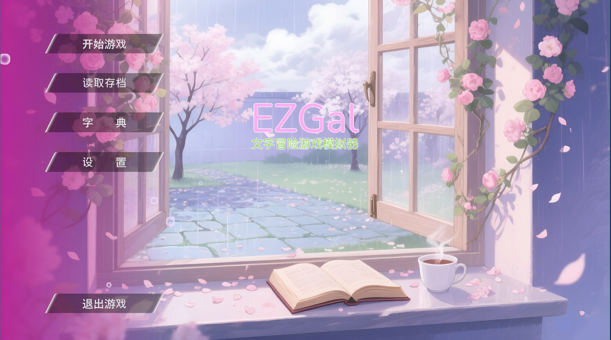

# Ezgal

Ezgal is a text adventure game development template based on Godot Mono.

## Contents

### Ezgal

- **Definition**  
  - **Logical Definition**  
  - **Functional Definition**  
  - **Language Definition**

* **Low Code Development Instructions**  
  - **Support**  
  - **Development**  
  - **Distribution**

### Ezlang  

* **Syntax Design**  
  - **Scripting**  
  - **Performance**  

* **Code Writing Specifications**  
  - **Godot**  
  - **C#**  
  - **Gdscript**

### Developers

* **Contribute**  
  - **How to Help and Contribute**  
  - **Label Explanation**

## Tools

* **Make Build Tool**  
  - **CI Testing**  
  - **Markdown Translation Tool**